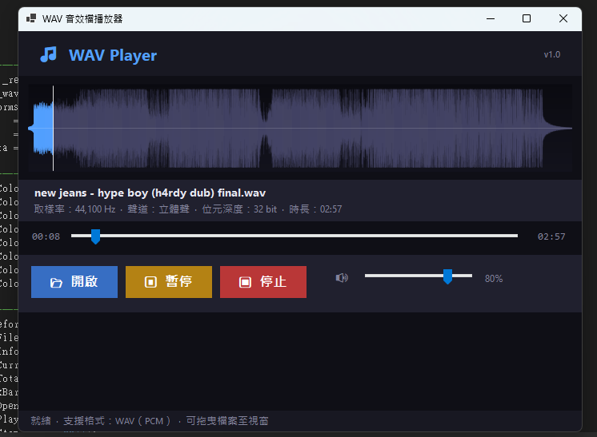

# 🎵 WAV 音效檔播放器

Windows 視窗程式設計 (II) — 上課練習 (3)

---

## 專案簡介

以 **C# Windows Forms (.NET 8)** 開發的 WAV 音效檔播放器，使用 [NAudio](https://github.com/naudio/NAudio) 函式庫實現音訊播放功能。

### 主要功能

| 功能 | 說明 |
|------|------|
| 開啟檔案 | 支援透過檔案對話框選取 WAV 檔案 |
| 拖曳開檔 | 可將 WAV 檔案直接拖曳至視窗 |
| 播放 / 暫停 | 切換播放與暫停狀態 |
| 停止 | 停止播放並回到開頭 |
| 進度條 | 即時顯示播放進度，支援拖曳跳轉 |
| 音量控制 | 滑桿即時調整播放音量 |
| 波形顯示 | 將 WAV 音訊資料繪製為彩色波形圖，並顯示播放位置 |
| 檔案資訊 | 顯示取樣率、聲道、位元深度、時長 |

---

## 執行說明

### 環境需求

- Windows 10 / 11
- [.NET 8 SDK](https://dotnet.microsoft.com/download/dotnet/8.0)
- Visual Studio 2022（建議）或 `dotnet` CLI

### 使用 Visual Studio 開啟

1. 開啟 `WavPlayer.csproj`
2. 按 `F5` 執行，NuGet 套件會自動還原

### 使用 CLI 執行

```bash
dotnet run --project WavPlayer.csproj
```

---

## 操作方式

1. 點擊 **📂 開啟** 按鈕，或將 `.wav` 檔案拖曳至視窗
2. 點擊 **▶ 播放** 開始播放
3. 播放中可拖曳 **進度條** 跳轉到任意位置
4. 調整右側 **🔊 音量滑桿** 控制音量
5. 點擊 **⏸ 暫停** 暫停播放，再次點擊繼續
6. 點擊 **⏹ 停止** 結束播放並回到開頭

---

## 截圖

 

---

## 專案結構

```
WavPlayer/
├── WavPlayer.csproj   # 專案設定（含 NAudio NuGet 參照）
├── Program.cs         # 程式進入點
├── Form1.cs           # 主視窗（UI + 音訊邏輯）
├── .gitignore
└── README.md
```

---

## 使用的套件

- **NAudio 2.2.1** — .NET 音訊處理函式庫，提供 WAV 解碼與播放功能
